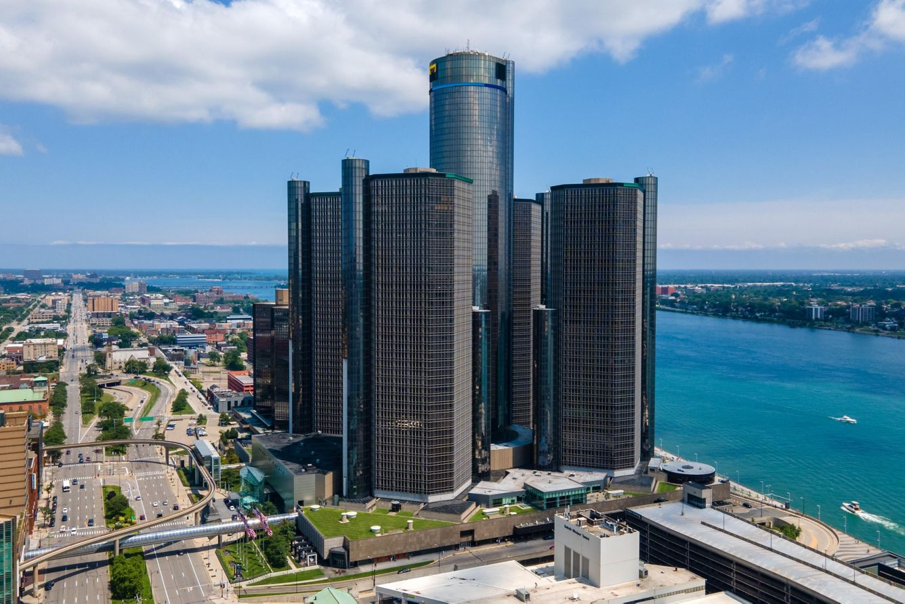
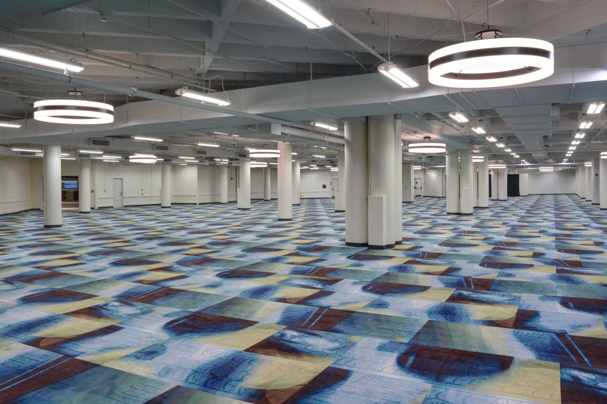

These competition rules are prepared for _28th RoboRacer Autonomous Racing Competition_. These are valid for this event only and extend the [General Rules]().

# Venue

The competition will take place in [Detroit Marriott at the Renaissance Center](https://www.marriott.com/en-us/hotels/dtwdt-detroit-marriott-at-the-renaissance-center/overview), Detroit, MI, United States. It will be a part of [2026 IEEE Intelligent Vehicles Symposium (IV)]("https://ieee-iv.org/2026/").

# Vehicle Specifications

- Additional requirements:
  - Space for sticker: 40×15 mm (on a visible location; e.g., front or top of the car). Sticker will be used to certify your on-site registration.

# Track details

- _Nature of the surface (flatness, reflectiveness, material):_
  - Carpet with low reflectiveness.

- _Nature of the room (e.g., walls/windows, ceiling type):_
  - No windows in the close vicinity of the track. Ceiling is not flat, exposing the full building structure. Room lightning is mostly artificial.
  
- _Type of delimiters (e.g., air ducts, cardboard boxes):_
  - Yellow pipes with black stripes.
  - Orange pipes with black stripes.

- _Height of delimiters:_
  - At least 30 cm.

- _Maximum size (e.g., area) of the track:_
  - 30×30 m.

- _Minimum track width (minimum distance between the inner and outer border):_

  - 1 m (however we aim to have at least 1.5 m in most of the track sections).

# Registration

Registration for the competition is split into two parts:

1. Competition registration, i.e., register a team with us to be able to compete.
2. Conference registration, i.e., register each team member to gain access to the competition area.

## Competition registration

Competition registration is done using a registration form available on the competition website. We provide up to 4 chairs, 1 table and 1 power socket for every team.

The registration is considered final (i.e., the team becomes approved) when the teams submit the form with:

- All required team data.
- A link to a video of their car driving autonomously (~1 minute).
- A hardware list that will be made public after the competition.

Note that the approved teams will be able to update their hardware list even after finalizing their registration; however, at latest by the date of the registration deadline.
In the case of unapproved hardware (e.g., sensors out of the allowed specification) we will inform the team and give them an opportunity to change the hardware.

## Conference registration

In order to get access to the competition area, every team member must register and pay the registration fee on the IV website.

- The competitions-only registration rate is  TBA  per person. This fee is available only with a given "discount code", available to all teams during the Competition registration.
- Other types of registration (e.g., paper author) usually contain the access to the competition area. No other registration is therefore necessary.
- Any questions, regarding the registration or visa letter, can be addressed to [contact@roboracer.ai](mailto:contact@roboracer.ai).

# Session

- Timetables of the sessions will become available on the first day of the competition.
- _List of used notification systems:_
  - Colored flags.
    - One set of flags for both teams.

# Practice

Practice track will contain all track features used in the Classic Cup of the competition. Additional track features, present only in Master Cup, will be present only in the Practice(s) after Classic Cup concludes.

- _List of Practice variants:_
  - Shared Practice.
  - Open Practice.
  - Closed Practice.
- Practice track will have the same layout as the track used during the Classic Cup.

# Inspection

Car inspection will be done during the first day of the competition. Generally, we will confirm that your car matches the submitted hardware list and is within the rule spec.
- When a car passes inspection, it will be given a marking tag placed on the top of the car.
- You may take part in the Practice sessions without Inspection.

# Qualification

Qualification won't be organized as a separate session. The teams will qualify for Head-to-Head races in two parts:

- Obstacle avoidance and kill-switch capability will be tested during a specific session.
  - Demonstrating ability to avoid a static obstacle.
  - The car MUST avoid touching and crashing into anything (including the track).
  - Multiple attempts are possible (up to the time allocated for the testing).
  - Failing the obstacle avoidance test means that the team can attend only Time Trial, but not Head-to-Head.
    - An extra attempt MAY be allowed during one of the Time Trial heats. Obstacle Avoidance testing will use the time of the allocated heat.
    - Passing the test during this extra attempt makes the team eligible for Head-to-Head.
    - Failing to pass the obstacle avoidance test at all results in disqualification.

- Completing at least one full lap during Time Trial without crashing.

# Race organization

- _List of possible ways to start a race:_
  - Manual
  - All races start when the steward says "Go". 
  - A countdown may precede the start unless otherwise stated.

# Time Trial

- _Number of heats, time per heat:_
  - 2 heats, ≤ 5 minutes each. Announced on the first day of the competition.

# Head-to-Head

- _Initial placement of the starting cars:_
  - Parallel Start
- _Tournament type:_
  - Double Elimination ( Tenative )
- _Competition model:_
  - Single Cup
    - Seeded with the results of the Time Trial.
  
- _Evaluation:_
  - Number of laps will be cup-based and announced on the first day of the competition.

# Award ceremony

The Award ceremony will be held at the end of the race day on Tuesday.

- Tueday, 16:30−18:00 ( Tentative )
