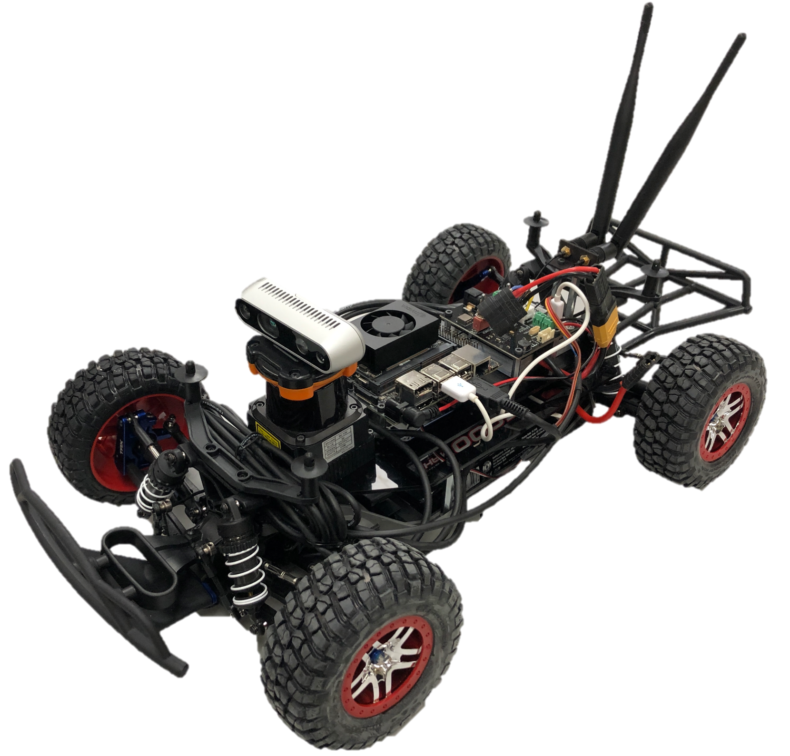
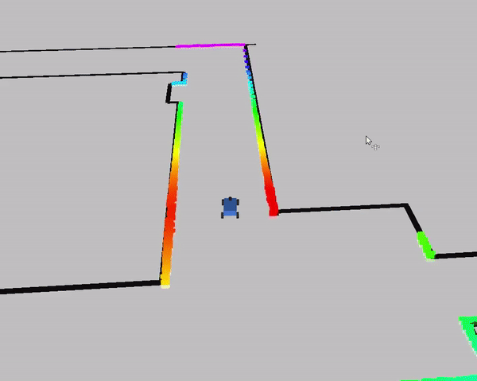
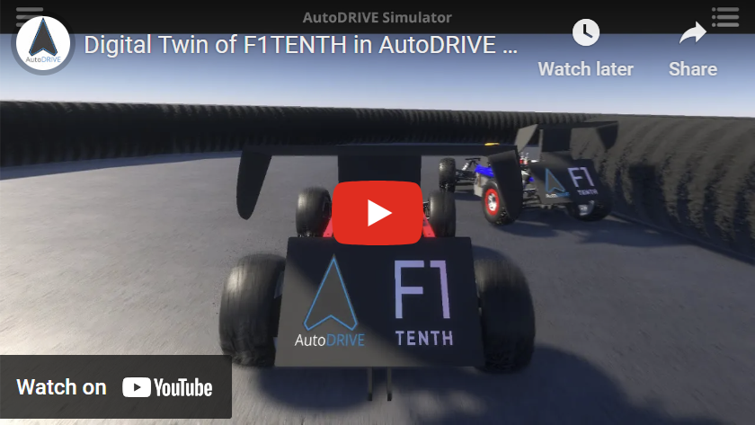
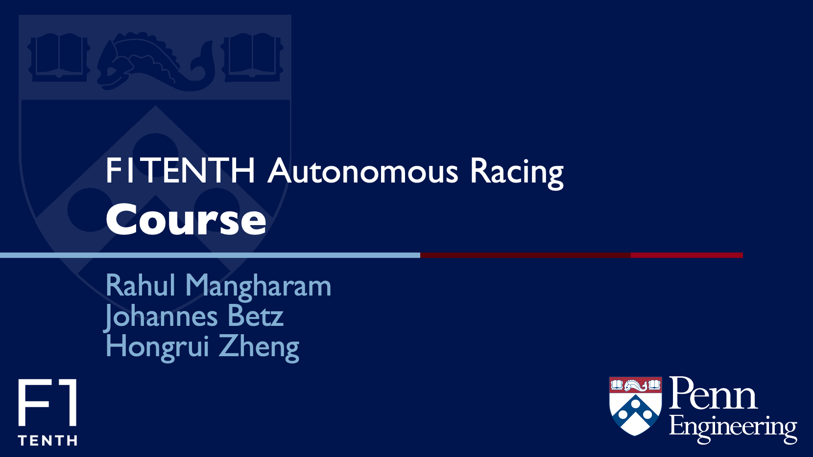

<h3>Build</h3>

We designed and maintain the Roboracer Autonomous Vehicle System, a powerful
and versatile open-source platform for autonomous systems research and education on a 1:10 scale.
This vehicle defines the baseline for the in-person competition and provides both sensors as well as
enough computation power to run autonomous driving algorithms. If you want to take part in the
in-person competition you have to bring your own Roboracer racecar. A detailed description on how to
build the vehicle including videos and a step by step instruction can be found here: <a
href="https://roboracer.ai/build.html">Roboracer Build Instructions </a>

<h3>Simulation</h3>

Autonomous Driving needs heavy development in simulation to provide a good
evaluation for the developed algorithms before we bring them on the car. We provide different
simulation environments that can help you in your development. The <a
href="https://github.com/f1tenth/f1tenth_gym">Roboracer Gym</a> is an asynchronous, 2D simulator
built in Python. This simulation runs faster than real-time execution (30x realtime), provides a
realistic vehicle simulation and collision, runs multiple vehicle instances and publishes laser scan
and odometry data. When it comes to a more close vehicle development we provide the <a
href="https://github.com/f1tenth/f1tenth_gym_ros">Roboracer ROS Simulator</a> which is providing
the ROS messages from the Roboracer car in and simulation environment.

<h3>Digital Twin</h3>

You can leverage the <a
href="https://autodrive-ecosystem.github.io/">AutoDRIVE Simulator</a> to simulate high-fidelity
3D <a href="https://youtu.be/Rq7Wwcwn1uk?feature=shared">digital twin</a> of the Roboracer racecar
within any virtual racetrack in real-time. AutoDRIVE Simulator offers photorealistic graphics, and
high-fidelity vehicle dynamics simulation along with physically accurate sensor and actuator models
to bridge the gap between simulation and reality – the simulator holds a track-record of enabling
zero-shot sim2real transfer of various autonomy algorithms. The simulator supports single as well as
multi-agent racing scenarios including manual (human vs. human), autonomous (AI vs. AI) as well as
mixed (human vs. AI) races. It offers various <a
href="https://github.com/Tinker-Twins/AutoDRIVE/tree/AutoDRIVE-Devkit">APIs</a> to flexibly
develop autonomy algorithms and supports a range of <a
href="https://youtu.be/_cwrw1w5d_g?si=GHBhRSDZh2AwvwKj">HMIs</a> to observe and interact with
the digital twins in real-time. This simulator will be used for the <a
href="https://autodrive-ecosystem.github.io/competitions/roboracer-sim-racing-icra-2025/">Roboracer
Sim Racing League</a>, but you can also use it to prototype your autonomous racing algorithms
before deploying them on the physical vehicles. The best part – AutoDRIVE Simulator is completely <a
href="https://github.com/Tinker-Twins/AutoDRIVE/tree/AutoDRIVE-Simulator">open-source</a> and
can be customized to fit your R&D objectives beyond this competition!

<h3>Autonomous Racing</h3>

If you are new to the field of autonomous racing then we can provide some
useful learning resources for you. The complete material from our Roboracer Penn course can be found
online at <a href="https://roboracer.ai/learn.html">Roboracer Learn </a>. This course provides
lectures about autonomous driving foundations, includes tutorials about the Roboracer car and
provides you with some insights in autonomous racing techniques e.g. raceline finding. In addition
all lectures were recorded and can be foun at the <a href="https://youtu.be/zENhppcxwzY">Roboracer
Autonomous Racing Course </a> on Youtube. 

